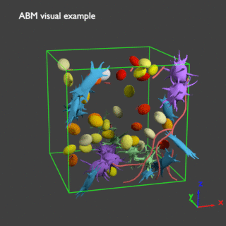
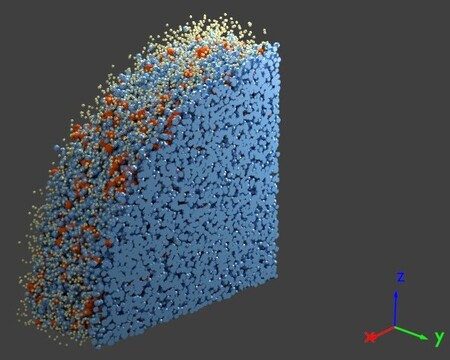
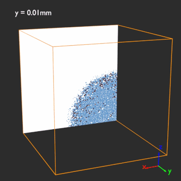
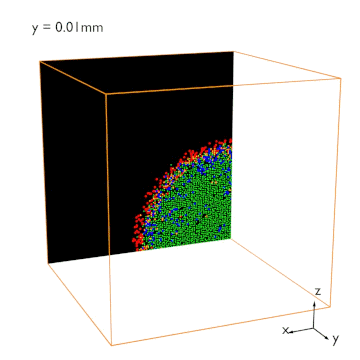
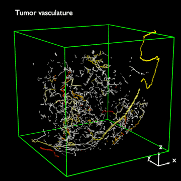
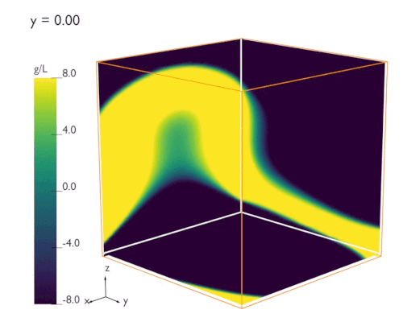
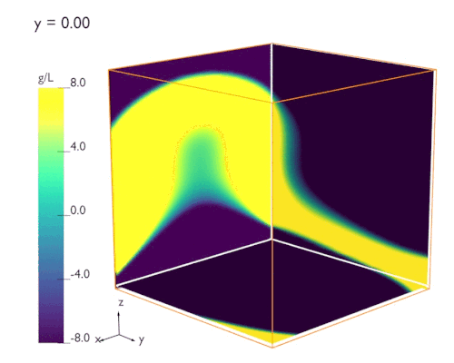
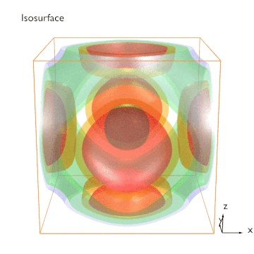
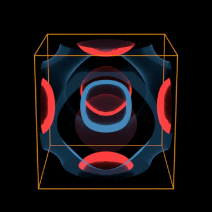
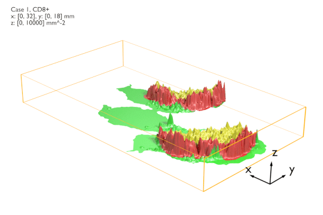

# ABM_visual #

Blender scripts to visualize elements of ABM simulation results.

## **Overview**

### Features: 
1.	Visualize large numbers of cells, with:
    *   Colors, shapes, sizes.
    *   Can choose to set different colors for individual cells based on feature values.
    *   Instantiate cells from particle system and create clean cut (less efficient).
2.	Visualize graph/network:
    *   Colors and thickness of individual edges.
    *   A few alternative methods to choose for best performance based on amount of details needed.
3.  Volumne rendering:
    *   Moving cross sections.
    *   Iso surfaces.
4.  Simulated IHC
    *   Bright filed IHC.
    *   Multiplex immunofluorescence.
5.  Studio setup:
    *   Three point lighting.
    *   Gadgets including axis arrows, colorbar, text title, etc.
    *   Joints for easy rotation and distance adjustment.

### Contents:
*   LIB
    *   BlenderVisual: main modules
        *   blender_element: basic blender mesh/object/material/etc. manipulation.
        *   blender_composite: ABM compnents classes with class methods.
        *   blender_utility: frequenty used shorthands.
*   resources
    *   objects: 3D models of cell shape.
    *   background: background images.
*   example: scripts to demonstrate package features.
*   legacy_2.79: scripts for 2.79. No longer maintained.

### Environment:

*   Blender 2.80
    *   May need additional python packages for some computational tasks.

## **TODO**

## **Examples**
1\. Visualizing basic ABM items.

`/example/ABMVisual.py`

A series of these snapshots can be combined to create a time-lapse video.

`/example/ABMVisual_timelapse.py`

To dislay features inside a group of cells, sharp cross-section can be created.

`/example/flat_cut.py`

2\. Simulating IHC.

Cross section the grid and designate markers/colors to differe t cell types.

`/example/ABM_IHC.py`

Or, change background color and mimic multiplex immunofluorescence.

`/example/ABM_mIF.py`

3\. Visualizing networks/graph. 

Specify thickness and color to invidual edges.

`/example/graph.py`

4\. Volume visualization

Create a moving cross section through the grid.

`/example/VolumeSection.py`

Make the cross sections transparent, and display multiple of them at the same time.

`/example/VolumeSection_transparent.py`

Create isosurfaces of the concentration filed.

`/example/VolumeVisual.py`

Change materials to obtain different effects.

`/example/VolumeVisual_alt.py`

5\. Visualizing a quantity defined on 2D plane F(x,y) as a 3D surface.

Height represents value F(x, y) and colors represent some other associated property G(x, y).

`/example/surf_3D_intensity.py`

